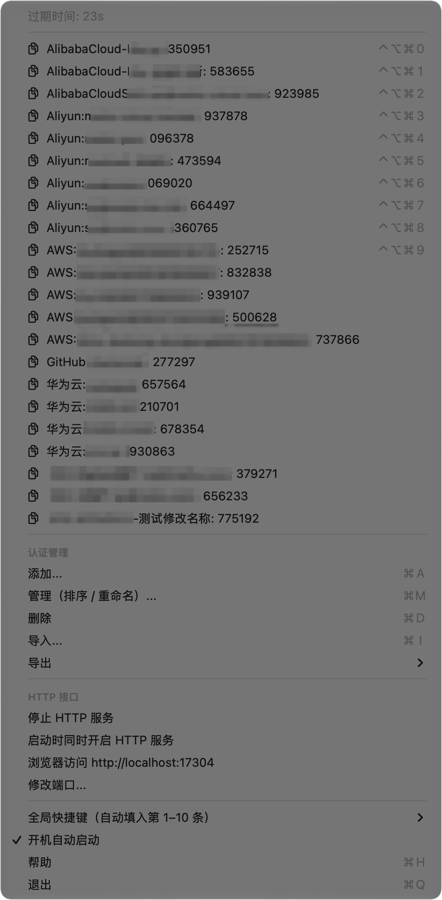
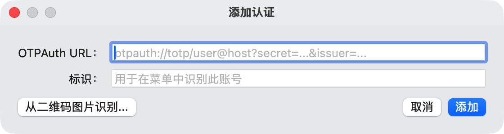
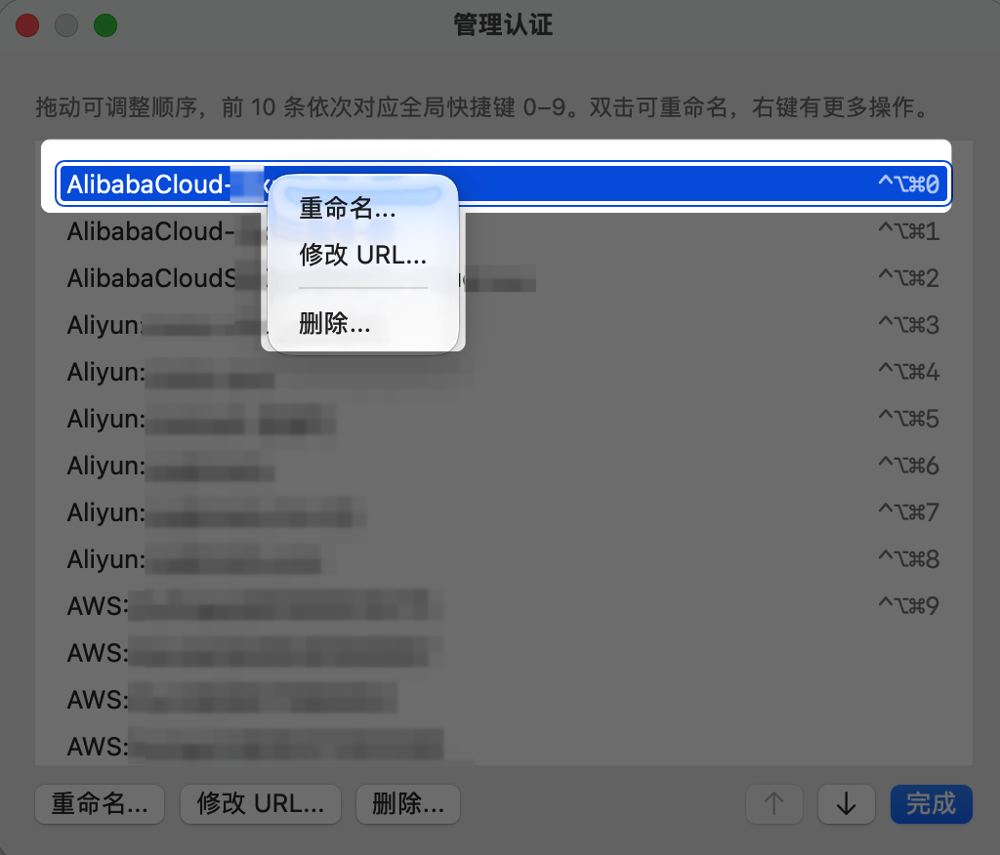
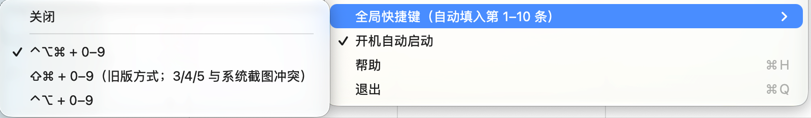
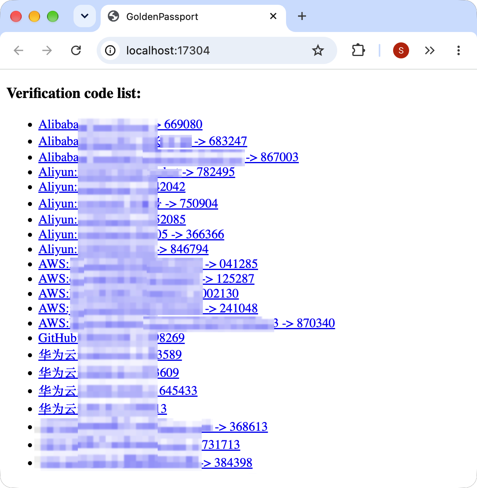

# GoldenPassport

[English](README.md) | 简体中文

macOS 菜单栏上的原生 Google Authenticator（谷歌身份验证器）。点一下菜单，或者按一个快捷键，就能拿到 TOTP 验证码。

> **这是 [stanzhai/GoldenPassport](https://github.com/stanzhai/GoldenPassport) 的维护分支（fork）。**
> 原项目从 2022 年起就没有更新了，Homebrew 也在 2026 年 9 月禁用了它的 cask。这里的 0.2.0 版本针对新版 macOS 从头重写，0.1.x 的用户可以直接覆盖升级：还是同一个 App、同一个 Bundle ID，已有的账号会自动迁移。
> 最初的创意和设计都来自原作者 [StanZhai](https://github.com/stanzhai)，在此致谢。

- 原生 Swift 编写，**Apple Silicon 原生运行**（通用版也支持 Intel 芯片），需要 macOS 13 或更高版本
- 不依赖任何第三方库
- 支持简体中文和英文界面，跟随系统语言。如果系统语言是英文、但想让 GoldenPassport 显示中文：系统设置 → 通用 → 语言与地区 → 应用程序，为 GoldenPassport 单独选择「简体中文」

# 截图

- [菜单栏菜单](#菜单栏菜单)
- [添加账号](#添加账号)
- [管理账号](#管理账号)
- [快捷键设置](#快捷键设置)
- [本地 HTTP 接口](#本地-http-接口)

### 菜单栏菜单

点击菜单栏上的钥匙图标。第一行是验证码刷新的倒计时。每个账号显示为「名称: 验证码」，点击即可复制验证码。前 10 个账号右侧标出了对应的全局快捷键。列表下方依次是认证管理、HTTP 接口、全局快捷键和开机自动启动。



### 添加账号

选择「添加...」（⌘A），粘贴 `otpauth://` URL，或者点「从二维码图片识别...」选择一张二维码图片。标识会根据 URL 里的标签自动填写，添加前可以修改。



### 管理账号

「管理（排序 / 重命名）...」（⌘M）按菜单中的顺序列出所有账号。拖动或用上下箭头调整顺序，前 10 行会标出对应的快捷键。双击可以重命名；右键可以选择「重命名」「修改 URL」「删除」，底部也有同样的按钮。



### 快捷键设置

在「全局快捷键」子菜单里选择配合 0–9 使用的修饰键：⌃⌥⌘（默认）、⇧⌘（0.1.x 的方式，其中 3/4/5 和系统截图快捷键冲突）、⌃⌥，或者关闭。打勾的是当前设置。



### 本地 HTTP 接口

开启 HTTP 接口后，打开 `http://localhost:17304/` 会列出所有账号和当前的验证码。每一项都链接到 `/code/<名称>`，这个地址只返回纯文本的验证码，方便在脚本里使用。中文账号名可以正常显示。



# 0.2.0 有哪些变化

以下对比的是原版最后一个版本 0.1.7。

### 从头重写

- 改用 Swift Package 构建，不再使用 Xcode 工程和 CocoaPods。原来的 Objective-C 验证码代码、内置的 google-toolbox-for-mac 源码和 Swifter HTTP 服务器都已移除。
- TOTP 基于 CryptoKit 实现，支持 otpauth URL 中的 `algorithm`、`digits`、`period` 参数（SHA1 / SHA256 / SHA512，6–8 位），并通过了 RFC 6238 的标准测试向量。
- 账号改为有序列表存储（`accounts.json`）。原来用的是字典，每次启动顺序都可能变。
- 41 个单元测试，覆盖 TOTP、URL 解析、存储、数据迁移和 HTTP 接口。

### 新功能

- **管理窗口**（⌘M）：拖动或用上下箭头调整顺序，双击重命名，右键修改 URL 或删除（[#12](https://github.com/stanzhai/GoldenPassport/issues/12)、[#17](https://github.com/stanzhai/GoldenPassport/issues/17)、[#29](https://github.com/stanzhai/GoldenPassport/issues/29)）。
- **全局快捷键可配置**：⌃⌥⌘0–9（新的默认值）、⇧⌘0–9（0.1.x 的方式）、⌃⌥0–9，或者关闭。改为系统级注册，按键不会再同时传给当前 App（[#4](https://github.com/stanzhai/GoldenPassport/issues/4)、[#11](https://github.com/stanzhai/GoldenPassport/issues/11)、[#18](https://github.com/stanzhai/GoldenPassport/issues/18)）。
- **导出 otpauth URL 列表**（`.txt`），可以导入其他验证器 App。导入同时支持这种格式和 `.secrets` 备份文件（[#10](https://github.com/stanzhai/GoldenPassport/issues/10)、[#30](https://github.com/stanzhai/GoldenPassport/issues/30)）。
- **开机自动启动**开关。
- 添加账号时，会根据 otpauth URL 里的标签自动填写标识；粘贴的 URL 会自动去掉首尾空白（[#26](https://github.com/stanzhai/GoldenPassport/issues/26)）。

### 问题修复

- 添加账号或识别二维码图片时闪退（[#1](https://github.com/stanzhai/GoldenPassport/issues/1)、[#16](https://github.com/stanzhai/GoldenPassport/issues/16)、[#21](https://github.com/stanzhai/GoldenPassport/issues/21)、[#22](https://github.com/stanzhai/GoldenPassport/issues/22)、[#25](https://github.com/stanzhai/GoldenPassport/issues/25)、[#28](https://github.com/stanzhai/GoldenPassport/issues/28)）。如果你仍然遇到，欢迎附上详情重新开 issue。
- 输入框里可以正常使用 ⌘V / ⌘C / ⌘A 了（[#9](https://github.com/stanzhai/GoldenPassport/issues/9)）。
- HTTP 页面声明了 UTF-8 编码，中文账号名不再乱码（[#26](https://github.com/stanzhai/GoldenPassport/issues/26)）。
- 重名时会提示，不再静默覆盖已有账号。
- 删除账号前会先确认。
- Bartender 等菜单栏管理工具可以识别 GoldenPassport 的图标了。

### 安全与隐私

- HTTP 接口只监听 127.0.0.1，并拒绝 `Host` 头不是本机的请求（[#6](https://github.com/stanzhai/GoldenPassport/issues/6)），网页无法通过 DNS 重绑定读取你的验证码。
- 数据文件仅本人可读：数据目录权限为 `0700`，文件为 `0600`。0.1.x 的文件本机所有用户都能读，0.2.0 会收紧已有文件的权限，但不改动文件内容。
- 两种导出格式在导出前都会提示：文件里是未加密的全部密钥。
- 密钥副本可能存在的所有位置，见[数据与安全](#数据与安全)。

### 需要注意的行为变化

| | 0.1.x | 0.2.0 |
|---|---|---|
| 最低系统版本 | 10.10 | **13** |
| 默认快捷键 | ⇧⌘0–9（3/4/5 和系统截图冲突） | **⌃⌥⌘0–9**；仍可在菜单里切换回 ⇧⌘ |
| 自动填入验证码 | 需要辅助功能权限 | 仍然需要，而且升级后要**重新授权** |
| 数据文件 | `gp.secrets` | `accounts.json`（首次启动时自动迁移；`gp.secrets` 会保留，但之后不再更新） |
| 账号顺序 | 每次启动都可能变化 | 迁移后按名称排序，之后按你调整的顺序 |

# 安装

> [!NOTE]
> 目前的安装包**还没有经过 Apple 公证**，从网上下载后直接打开会被 macOS 拦截。下面的安装脚本会帮你处理好。Apple 公证和 Homebrew cask 都在[后续计划](#后续计划)中。现在执行 `brew install --cask goldenpassport` 装的是旧版 0.1.7，而且这个 cask 已被 Homebrew 禁用。

### 从 0.1.x 升级，或全新安装（推荐）

1. 从本仓库的 [Releases](https://github.com/thatscode/GoldenPassport/releases) 页面下载 `GoldenPassport-<版本号>.zip` 并解压。
2. 打开「终端」，输入 `bash `（注意后面有一个空格），把解压出来的 `install.sh` 拖进终端窗口，按回车。

安装脚本会依次：

1. 检查安装包是否完整，以及是否支持你的 Mac 和系统版本；
2. 把当前的 App 和数据备份到 `~/GoldenPassport-backups/<时间>/`（⚠️ 备份里是未加密的密钥，见[数据与安全](#数据与安全)）；
3. 退出正在运行的旧版，把新版安装到「应用程序」；
4. 迁移账号，并和 `gp.secrets` 逐条核对，过程中只显示账号名称。**如果有任何一条不一致，会自动恢复到安装前的 App 和数据**；
5. 启动 GoldenPassport。

<!-- SCREENSHOT install.png：install.sh 运行成功后的终端输出，包含「已从旧版迁移 N 条记录…逐条一致」那一行和警告框。 -->
<!--  -->

升级之后，如果希望快捷键自动填入验证码，需要重新授权**辅助功能**：系统设置 → 隐私与安全性 → 辅助功能。如果列表里已经有 GoldenPassport，但按快捷键不会自动填入，先用「−」把它删掉，再到菜单里重新选一次快捷键，系统就会重新请求授权。没授权时，按快捷键会把验证码复制到剪贴板。

### 回退

在同一个文件夹里执行 `bash rollback.sh`，就会恢复安装前的 App。原来的 `gp.secrets` 从未被修改过，所以 0.1.x 能看到原来的全部账号。在 0.2.0 里新增或修改的账号，0.1.x 看不到。如果要保留，先在 0.2.0 里导出 `.secrets` 备份文件，回退后再导入 0.1.x。执行 `bash rollback.sh --restore-data` 会把数据目录也恢复到安装前。

### 升级后的清理

确认 0.2.0 使用正常、不再需要回退后，在同一个文件夹里执行 `bash cleanup.sh`。脚本会先确认 `accounts.json` 读取正常，再列出要删除的内容：安装备份，以及旧版的 `gp.secrets` / `config.plist`，这些都含有未加密的密钥。如果新版的账号比旧版数据文件里的少，会额外提醒。输入 `yes` 后才会删除。清理之后，就不能再回退到 0.1.x 了。

### 手动安装

把 `GoldenPassport.app` 复制到「应用程序」，然后二选一：执行 `xattr -dr com.apple.quarantine /Applications/GoldenPassport.app`；或者先打开一次，再到 系统设置 → 隐私与安全性 里点「仍要打开」。首次启动时会自动迁移数据，但手动安装没有备份，也没有迁移核对。

# 使用

点击菜单栏上的钥匙图标，每个账号后面就是当前的验证码，点一下即可复制。

| 菜单项 | 作用 |
|---|---|
| 添加...（⌘A） | 通过 otpauth URL 或二维码图片添加账号 |
| 管理（排序 / 重命名）...（⌘M） | 调整顺序、重命名、修改 URL、删除账号 |
| 删除（⌘D） | 删除账号，删除前会确认 |
| 导入...（⌘I） | 导入 `.secrets` 备份文件或 otpauth URL 列表；已存在的名称会跳过 |
| 导出 → 备份文件（.secrets） | 新旧版本都能导入的备份 |
| 导出 → otpauth URL 列表（.txt） | 每个账号一行 otpauth URL，可导入其他验证器 App |
| HTTP 接口 | 开启或停止本地接口、设置随启动开启、在浏览器中打开、修改端口 |
| 全局快捷键 | 选择快捷键的修饰键，或者关闭 |
| 开机自动启动 | 登录时自动启动 GoldenPassport |
| 帮助（⌘H） | 打开 GitHub 项目主页 |

### 全局快捷键

修饰键 + **0** 填入列表中**第 1 个**账号的验证码，修饰键 + **1** 是第 2 个，依此类推，**9** 对应第 10 个。在管理窗口里调整顺序，就能决定哪些账号有快捷键。

### RESTful API

开启后，GoldenPassport 会在 `http://localhost:17304/` 上提供验证码（端口可以在菜单里修改），只监听 127.0.0.1。

| 接口 | 返回内容 |
|---|---|
| `GET /` | 列出所有账号的 HTML 页面，每个账号链接到它的验证码 |
| `GET /code/<账号名称>` | 纯文本格式的当前验证码；没有这个账号时返回 `404` |

```sh
code=$(curl -s 'http://localhost:17304/code/test@stanzhai.site')
echo "$code"
```

# 数据与安全

> [!CAUTION]
> **从 0.1.x 升级后，磁盘上会留有未加密的 MFA 密钥副本。**
>
> - **安装脚本的备份**：`scripts/install.sh` 会把整个数据目录复制到 `~/GoldenPassport-backups/<时间>/`，用于回退。这是全部密钥的明文副本（权限为仅本人可读）。不要分享或同步它，确认不再需要回退后请删除（用 `scripts/cleanup.sh`，见下文）。
> - **旧版数据文件**：迁移后 `gp.secrets` 会保留在数据目录里，旧版才能继续使用。它之后不再更新，所以**你在 0.2.x 里删除的账号，密钥仍然留在这个文件里**。确定不会再回到 0.1.x 后，请删除它（用 `scripts/cleanup.sh`）。
> - **导出文件**：`.secrets` 和 `.txt` 两种导出文件都包含未加密的全部密钥。
> - **开发版**：`make dev` 首次启动时会把正式版的数据复制到 `GoldenPassport-Dev/`，开发结束后请删除这个目录。

所有数据都在 `~/Library/Application Support/GoldenPassport/`：`accounts.json`、`settings.json`，以及旧版的 `gp.secrets` / `config.plist`。密钥没有加密，只靠文件权限保护：0.2.x 会把目录权限设为 `0700`、文件设为 `0600`（0.1.x 的文件本机所有用户都能读）。

# 从源码构建

需要 Xcode 16 或更高版本（Swift 6 工具链），不依赖第三方库。

```
make test      # 单元测试（TOTP RFC 6238 测试向量、URL 解析、存储、迁移、HTTP 接口）
make dev       # 独立的「GoldenPassport Dev.app」：独立的 Bundle ID、数据目录、端口 17305，快捷键默认关闭
make run-dev   # 构建并启动开发版
make release   # 「GoldenPassport.app」，可直接替换已安装的正式版
make beta      # 通用版 + install.sh / rollback.sh / 测试说明，打包为 zip，放在 dist/ 目录
```

构建产物输出到 `~/Library/Caches/GoldenPassport-build/<variant>/`。之所以放在源码目录之外，是因为 iCloud 同步的目录会导致代码签名失败。`ARCHS="arm64 x86_64"` 可以构建通用版。构建出的 App 使用 ad-hoc 签名，并启用了 Hardened Runtime。

首次启动时，0.1.x 的数据（`gp.secrets`、`config.plist`）会在同一目录下迁移为 `accounts.json` / `settings.json`，旧文件保留不动（见[数据与安全](#数据与安全)）。`GoldenPassport --migrate-data [--data-dir PATH]` 可以在不打开界面的情况下执行同样的迁移并核对结果，`scripts/install.sh` 就是靠它完成核对的。开发版会把正式版的数据复制到 `GoldenPassport-Dev/`，从不写入正式版的数据目录，所以可以和已安装的正式版同时运行。

`scripts/rollback.sh` 用于恢复被 `install.sh` 替换掉的 App。`scripts/cleanup.sh` 用于在确定不再回到 0.1.x 后，删除安装备份和旧版的 `gp.secrets` / `config.plist`；只有在已安装 0.2.x、并且 `accounts.json` 读取正常时，它才会执行。内测说明见 [`docs/beta-testing.md`](docs/beta-testing.md)。

# 后续计划

- Developer ID 签名和 Apple 公证，下载后可以直接打开
- 恢复 Homebrew cask
- 可选：把密钥存入钥匙串

# 致谢与协议

GoldenPassport 由 [StanZhai](https://github.com/stanzhai) 于 2017 年创建，本 fork 由 [thatscode](https://github.com/thatscode) 维护。

原仓库没有附带开源协议。我们已经在 [stanzhai/GoldenPassport#33](https://github.com/stanzhai/GoldenPassport/issues/33) 中请作者补充，作者添加后本 fork 会采用相同的协议。

# 参考资料

- [RFC 6238：TOTP](https://www.rfc-editor.org/rfc/rfc6238)
- [Key URI 格式（otpauth://）](https://github.com/google/google-authenticator/wiki/Key-Uri-Format)
- [google-authenticator](https://github.com/google/google-authenticator)
